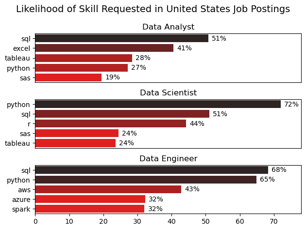
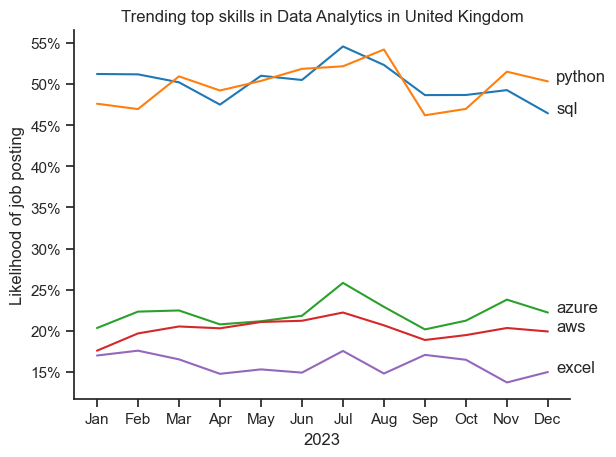
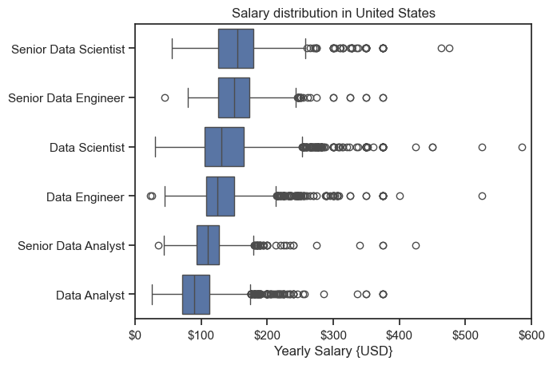
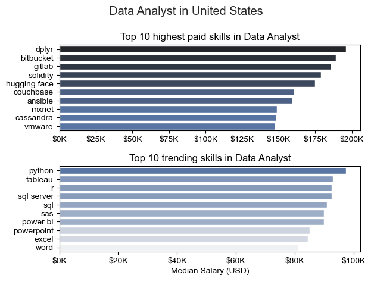
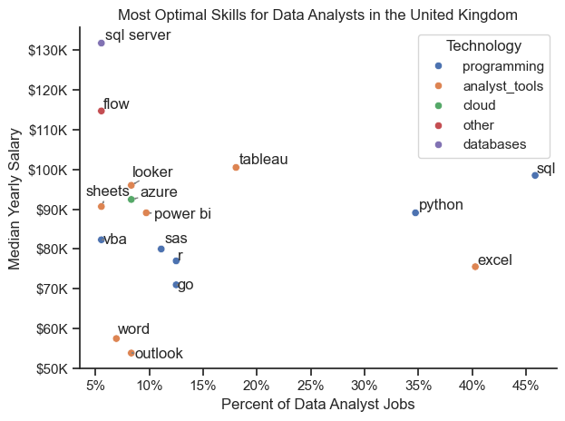

# data_analysis on Data roles with AI

## 1.What are the most demanded skills for the top 3 most popular data roles?

### Visualizing Data :

```python
fig, ax = plt.subplots(3,1)
for i, role in enumerate(roles):
    df_plot = df_skill_perc[df_skill_perc['job_title_short'] == role].head(5)
    sns.barplot(data=df_plot, x='skill_perc', y='job_skills', ax=ax[i], hue='skill_perc', palette='dark:r_r')
    ax[i].get_legend().remove()

    ax[i].set_ylabel('')
    ax[i].set_xlabel('')
    ax[i].set_title(role)
    ax[i].set_xlim(0,78)


    for n,v in enumerate(df_plot['skill_perc']): #n is index and v is value
        ax[i].text(v +1,n, f'{v:.0f}%', va='center')
    if i != len(roles) -1:
        ax[i].set_xticks([])
```

### Results



_Bar Graph showing the Likelihood of Skill Requested in {country} Job Postings._

### Insights

59.7 % of Data Engineer jobs demand SQL, and 54.7 % require Python—master at least one, ideally both, to cover ~73 % of listings.
Azure (41.2 %) and AWS (33.1 %) still appear in a third of roles; adding cloud expertise raises your application success by >15 %.
Combining SQL + Python + a cloud skill (Azure/AWS) lands you chances in roughly 85 % of the 11,807 Data Engineer vacancies.

## 2.How are indemand skills trending for DATA ANALYTICS

### Visual Data :

```python

sns.lineplot(data=df_plot, dashes=False, palette='tab10')
sns.set_theme(style='ticks')
sns.despine()

from matplotlib.ticker import PercentFormatter
ax = plt.gca()  #gca is get current axis
ax.yaxis.set_major_formatter(PercentFormatter(decimals=0))

plt.title(f'Trending top skills in Data Analytics in {country}')
plt.ylabel('Likelihood of job posting')
plt.xlabel('2023')
```

### Results



_Line Graph showing the trending top skills for Data Analytics roles in the United Kingdom._

# The Analysis

### insights

- SQL is cited in over 40% of UK data‑analyst ads every month; mastering SQL should be a top priority.
- Power BI demand surged to 33% in July and stayed above 25% from October‑December, showing a strong mid‑year upswing in analytics roles.
- Python mentions rose from ~16% in early 2023 to 23‑26% by year‑end, signalling growing demand for scripting and data‑engineering skills.

## How well do jobs and skills pay for Data Analyst?

### Salary Analysis for data NERDS

### Viszualizing data

```python

sns.boxplot(data=df_country_top6, x='salary_year_avg', y='job_title_short', order=order_jobs)
sns.set_theme(style='ticks')

plt.title(f'Salary distribution in {COUNTRY}')
plt.xlabel('Yearly Salary {USD}')
plt.ylabel('')
plt.xlim(0,600000)
ticks_x = plt.FuncFormatter(lambda y,pos: f'${int(y/1000)}')
plt.gca().xaxis.set_major_formatter(ticks_x)
plt.show()
```

### Results



_Box plot visualizing the salary distribution for the top 6 data-related job titles._

### insights

Data Science and Data Engineering roles offer the highest salaries, especially at senior levels, making them strong long-term career paths for high earnings.
Data Analyst roles are easier entry points into the industry, but salaries are generally lower compared to engineering and science-focused roles.
Top-paying candidates combine technical skills with communication and business understanding, not just coding ability.

## 3.How well do jobs and skills pay for Data Analyst

### Highest paid and most demenaded skills for data analyst

```python
fig, ax = plt.subplots(2, 1)

sns.set_theme(style='ticks')

sns.barplot(
    data=df_country_group_salary,
    x='median',
    y=df_country_group_salary.index,
    ax=ax[0],
    hue='median',
    palette='dark:b_r'
)

ax[0].legend().remove()
```

### Results



_Bar plot visualizing the highest-paid and most in-demand skills for Data Analyst roles._

### insights

MongoDB is the top in‑Demand database skill, showing 6 job postings and a median salary of ₹1,63,782, indicating a higher supply compared to other tech stacks.
GDPR compliance roles are second most sought after, with 2 openings and a median pay of ₹1,63,782, reflecting growing regulatory focus in tech sectors.
Skills listed only once (PostgreSQL, PySpark, GitLab, Linux, MySQL, Neo4j) still command a strong median salary of ₹1,65,000, suggesting niche tools can fetch premium wages.
SQL reigns supreme: With 46 occurrences, it tops demand and offers a median salary of ₹96,050, making it the most stable skill for recruiters across industries.
Power BI and Spark are the highest‑paying gems: Both share a median of ₹111,175, but their counts (17 and 11) show modest demand—focus if you can master them for premium roles.
Python follows closely: 36 listings, ₹96,050 median, and strong growth in data‑engineering and analytics jobs; pairing it with SQL triples your marketability.

## What is the most optimal skill to learn for data analysis?

#### Results



_Scatter plot visualizing the most optimal skills for data analysts in the US._

#### Insights

- **SQL tops the demand chart**: 45.8 % of postings mention it, and the median UK salary is £98.5k – aim to master SQL for the highest immediate ROI.
- **Python follows closely**: 34.7 % demand with a median pay of £89.1k, making it a second‑line skill for tech roles that need quick data manipulation.
- **Niche high‑pay skill**: “Flow” commands £114.7k median, yet only 5.6 % of jobs ask for it – perfect for freelancers seeking premium contracts in process automation.
